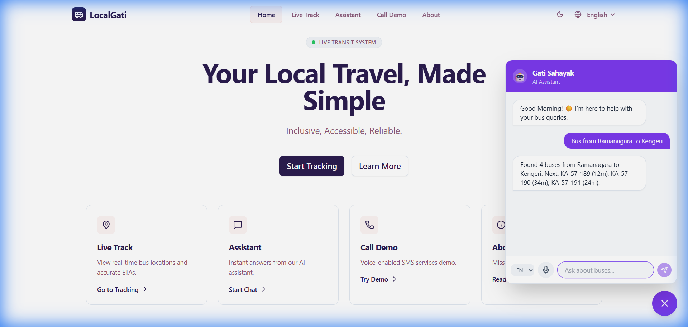

# 🚌 LocalGati: Inclusive Public Transport Tracking

<div align="center">
  <h3>Bridging the Gap Between Commuters and Public Transit</h3>
  <p>An AI-powered, Voice-enabled, and SMS-integrated solution for Bengaluru's Buses.</p>

  [](https://github.com/rohan-chand-m-01/No-Entity)
  [](LICENSE)
  [](https://reactjs.org/)
</div>

---

## 🌟 Overview

**LocalGati** empowers every commuter—regardless of language, tech-savviness, or internet access—to travel with confidence. 

We solve the "Information Black Hole" in public transport by providing **Verified** bus data through three accessible channels:
1.  **Web App**: Real-time Maps & Live Tracking.
2.  **Voice AI**: A conversational assistant ("Gati Sahayak").
3.  **Offline IVR**: A toll-free number for SMS updates on feature phones.

---

## 🚀 Key Features

| Feature | Description | Preview |
| :--- | :--- | :--- |
| **📍 Live Tracking** | Real-time GPS location of buses with accurate ETAs and route visualization. | *(Map View)* |
| **🤖 Gati Sahayak** | **Voice-Activated AI Assistant.** Speak in English, Kannada, or Hindi to find your bus instantly. |  |
| **📞 IVR & SMS** | **No Internet? No Problem.** Call our hotline, enter your bus number, and get an instant SMS. Fully localized for Kannada users. |  |
| **♿ Accessibility** | Native digit support (೦-೯) for Kannada, high-contrast UI, and screen reader compatibility. | *(Inclusive UI)* |

---

## 🛠️ Technology Stack

<div align="center">

[](https://reactjs.org/)
[](https://www.typescriptlang.org/)
[](https://tailwindcss.com/)
[](https://nodejs.org/)
[](https://expressjs.com/)
[](https://www.twilio.com/)
[](https://vitejs.dev/)

</div>

*   **Frontend**: React `(v18)`, TypeScript, Tailwind CSS, Framer Motion
*   **Backend**: Node.js, Express, Twilio SDK
*   **AI/ML**: Web Speech API (Voice Recognition), Custom Simulator Logic
*   **Services**: OpenStreetMap (Leaflet), Twilio API (SMS/Voice)

---

## 🚀 Getting Started

Follow these steps to set up LocalGati locally.

### Prerequisites
*   Node.js `v16.0.0` or higher
*   Twilio Account (SID & Auth Token)

### Installation

1.  **Clone the Repo**
    ```bash
    git clone https://github.com/rohan-chand-m-01/No-Entity.git
    cd No-Entity
    ```

2.  **Install Dependencies**
    ```bash
    npm install
    cd backend && npm install && cd ..
    ```

3.  **Configure Environment**
    Create `backend/.env` with your credentials:
    ```env
    PORT=5000
    TWILIO_ACCOUNT_SID=your_sid
    TWILIO_AUTH_TOKEN=your_token
    TWILIO_PHONE_NUMBER=your_number
    ```

4.  **Run the App**
    ```bash
    # Terminal 1 (Frontend)
    npm run dev

    # Terminal 2 (Backend)
    node backend/src/server.js
    ```

5.  **Visit App**: `http://localhost:5173`

---

## 📱 How to Demo the IVR Integration

> **Note**: This demo simulates the IVR experience in the browser but triggers **REAL** SMS messages to your phone.

1.  Navigate to **"Call Demo"** in the Navbar.
2.  **Enter your Phone Number**: Use a valid 10-digit Indian mobile number.
3.  **Select Language**: Choose **Kannada (ಕನ್ನಡ)** to see the UI transform with native digits.
4.  **Simulate Call**: Click "Start Call" (or "ಕರೆ ಪ್ರಾರಂಭಿಸಿ").
5.  **Enter Bus Code**: Type `189` on the keypad.
6.  **Success!** You will receive an SMS: *"Bus 189 is arriving in 5 mins at Majestic."*

---

## 🤝 Contributing

We welcome contributions! Please fork the repository and submit a Pull Request.

---

<div align="center">
  <p>Made with ❤️ for Namma Bengaluru 🇮🇳</p>
</div>
